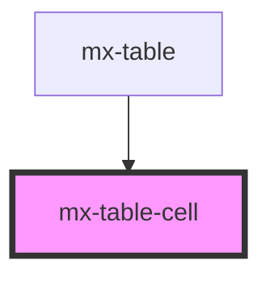

# mx-table-cell

<!-- Auto Generated Below -->

## Properties

| Property                | Attribute                  | Description                                                                             | Type      | Default     |
| ----------------------- | -------------------------- | --------------------------------------------------------------------------------------- | --------- | ----------- |
| `columnIndex`           | `column-index`             | This is automatically set by the parent `mx-table`.  For subheaders, this will be null. | `number`  | `undefined` |
| `heading`               | `heading`                  | This is automatically set by the parent `mx-table`.                                     | `string`  | `undefined` |
| `isExposedMobileColumn` | `is-exposed-mobile-column` | This is automatically set by the parent `mx-table`.                                     | `boolean` | `true`      |

## Dependencies

### Used by

 - [mx-table](../mx-table)

### Graph

----------------------------------------------

*Built with [StencilJS](https://stenciljs.com/)*
