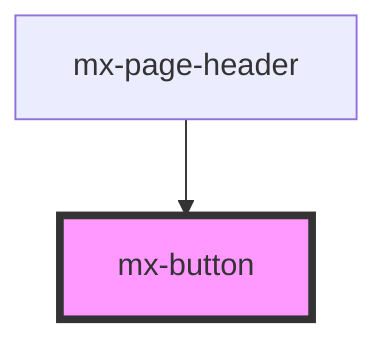

# mx-button

<!-- Auto Generated Below -->

## Properties

| Property    | Attribute    | Description                                          | Type                                                        | Default       |
| ----------- | ------------ | ---------------------------------------------------- | ----------------------------------------------------------- | ------------- |
| `ariaLabel` | `aria-label` | An aria-label is highly recommended for icon buttons | `string`                                                    | `undefined`   |
| `btnType`   | `btn-type`   |                                                      | `"action" \| "contained" \| "icon" \| "outlined" \| "text"` | `'contained'` |
| `disabled`  | `disabled`   |                                                      | `boolean`                                                   | `false`       |
| `dropdown`  | `dropdown`   | Show chevron icon                                    | `boolean`                                                   | `false`       |
| `full`      | `full`       | Sets display to flex instead of inline-flex          | `boolean`                                                   | `false`       |
| `href`      | `href`       | Create button as link                                | `string`                                                    | `undefined`   |
| `icon`      | `icon`       | Class name of icon                                   | `string`                                                    | `undefined`   |
| `target`    | `target`     | Only for link buttons                                | `string`                                                    | `undefined`   |
| `type`      | `type`       |                                                      | `"button" \| "reset" \| "submit"`                           | `'button'`    |
| `value`     | `value`      |                                                      | `string`                                                    | `undefined`   |
| `xl`        | `xl`         |                                                      | `boolean`                                                   | `false`       |

## Dependencies

### Used by

 - [mx-page-header](../mx-page-header)

### Graph

----------------------------------------------

*Built with [StencilJS](https://stenciljs.com/)*
