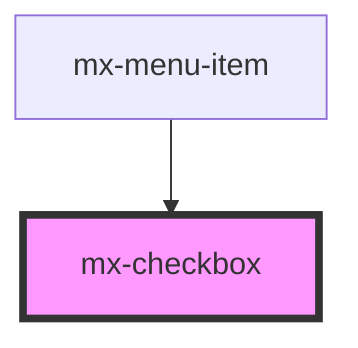

# mx-checkbox

<!-- Auto Generated Below -->

## Properties

| Property     | Attribute     | Description | Type      | Default |
| ------------ | ------------- | ----------- | --------- | ------- |
| `checked`    | `checked`     |             | `boolean` | `false` |
| `labelClass` | `label-class` |             | `string`  | `''`    |
| `labelLeft`  | `label-left`  |             | `boolean` | `false` |
| `labelName`  | `label-name`  |             | `string`  | `''`    |
| `name`       | `name`        |             | `string`  | `''`    |
| `value`      | `value`       |             | `string`  | `''`    |

## Dependencies

### Used by

 - [mx-menu-item](../mx-menu-item)

### Graph

----------------------------------------------

*Built with [StencilJS](https://stenciljs.com/)*
