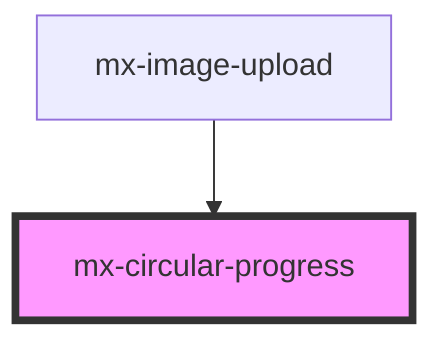

# mx-circular-progress

<!-- Auto Generated Below -->

## Properties

| Property                   | Attribute                    | Description                                                                                                                       | Type     | Default  |
| -------------------------- | ---------------------------- | --------------------------------------------------------------------------------------------------------------------------------- | -------- | -------- |
| `appearDelay`              | `appear-delay`               | Delay the appearance of the indicator for this many milliseconds                                                                  | `number` | `0`      |
| `simulateProgressDuration` | `simulate-progress-duration` | If provided, the indicator will simulate progress toward 99% over the given duration (milliseconds).                              | `number` | `null`   |
| `size`                     | `size`                       | The value to use for the width and height                                                                                         | `string` | `'3rem'` |
| `value`                    | `value`                      | The progress percentage from 0 to 100. If not provided (or set to `null`), an indeterminate progress indicator will be displayed. | `number` | `null`   |

## Dependencies

### Used by

 - [mx-image-upload](../mx-image-upload)

### Graph

----------------------------------------------

*Built with [StencilJS](https://stenciljs.com/)*
