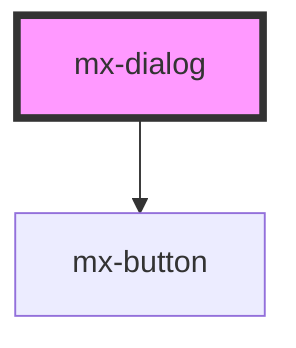

# mx-dialog

<!-- Auto Generated Below -->

## Methods

### `alert(message: string, { confirmLabel, cancelLabel, heading }?: DialogOptions) => Promise<void>`

A Promise-based replacement for `Window.alert()` with some additional options

#### Returns

Type: `Promise<void>`

### `confirm(message: string, { confirmLabel, cancelLabel, heading }?: DialogOptions) => Promise<boolean>`

A Promise-based replacement for `Window.confirm()` that resolves to a boolean

#### Returns

Type: `Promise<boolean>`

## Dependencies

### Depends on

- [mx-button](../mx-button)

### Graph

----------------------------------------------

*Built with [StencilJS](https://stenciljs.com/)*
