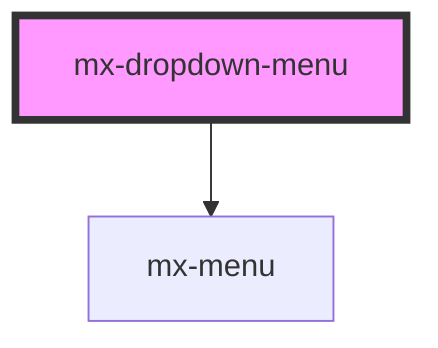

# mx-dropdown-menu

<!-- Auto Generated Below -->

## Properties

| Property        | Attribute        | Description                                                                                      | Type      | Default     |
| --------------- | ---------------- | ------------------------------------------------------------------------------------------------ | --------- | ----------- |
| `ariaLabel`     | `aria-label`     |                                                                                                  | `string`  | `undefined` |
| `dense`         | `dense`          |                                                                                                  | `boolean` | `false`     |
| `dropdownClass` | `dropdown-class` | Additional classes for the dropdown wrapper (e.g. `min-w-0` to override the default `min-width`) | `string`  | `undefined` |
| `dropdownId`    | `dropdown-id`    | The `id` attribute for the internal input element                                                | `string`  | `undefined` |
| `elevated`      | `elevated`       | Style as a filter dropdown with a 1dp elevation                                                  | `boolean` | `false`     |
| `flat`          | `flat`           | Style as a filter dropdown with a "flat" border color                                            | `boolean` | `false`     |
| `label`         | `label`          |                                                                                                  | `string`  | `undefined` |
| `name`          | `name`           |                                                                                                  | `string`  | `undefined` |
| `suffix`        | `suffix`         | Text shown to the left of the arrow                                                              | `string`  | `undefined` |
| `value`         | `value`          |                                                                                                  | `any`     | `undefined` |

## Dependencies

### Depends on

- [mx-menu](../mx-menu)

### Graph

----------------------------------------------

*Built with [StencilJS](https://stenciljs.com/)*
