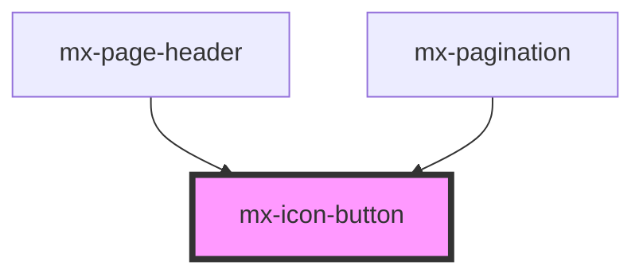

# mx-icon-button

<!-- Auto Generated Below -->

## Properties

| Property       | Attribute       | Description                         | Type                              | Default     |
| -------------- | --------------- | ----------------------------------- | --------------------------------- | ----------- |
| `ariaLabel`    | `aria-label`    | An aria-label is highly recommended | `string`                          | `undefined` |
| `chevronDown`  | `chevron-down`  | Show downward chevron icon          | `boolean`                         | `false`     |
| `chevronLeft`  | `chevron-left`  | Show left-pointing chevron icon     | `boolean`                         | `false`     |
| `chevronRight` | `chevron-right` | Show right-pointing chevron icon    | `boolean`                         | `false`     |
| `disabled`     | `disabled`      |                                     | `boolean`                         | `false`     |
| `icon`         | `icon`          | Class name of icon (for icon font)  | `string`                          | `undefined` |
| `type`         | `type`          |                                     | `"button" \| "reset" \| "submit"` | `'button'`  |
| `value`        | `value`         |                                     | `string`                          | `undefined` |

## Dependencies

### Used by

 - [mx-page-header](../mx-page-header)
 - [mx-pagination](../mx-pagination)

### Graph

----------------------------------------------

*Built with [StencilJS](https://stenciljs.com/)*
