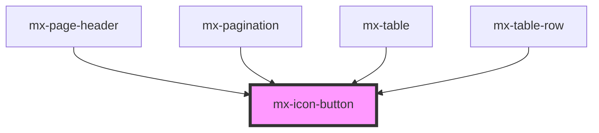

# mx-icon-button

<!-- Auto Generated Below -->

## Properties

| Property       | Attribute       | Description                                            | Type                              | Default     |
| -------------- | --------------- | ------------------------------------------------------ | --------------------------------- | ----------- |
| `chevronDown`  | `chevron-down`  | Show downward chevron icon                             | `boolean`                         | `false`     |
| `chevronLeft`  | `chevron-left`  | Show left-pointing chevron icon                        | `boolean`                         | `false`     |
| `chevronRight` | `chevron-right` | Show right-pointing chevron icon                       | `boolean`                         | `false`     |
| `disabled`     | `disabled`      |                                                        | `boolean`                         | `false`     |
| `elAriaLabel`  | `el-aria-label` | The aria-label attribute for the inner button element. | `string`                          | `undefined` |
| `form`         | `form`          |                                                        | `string`                          | `undefined` |
| `formaction`   | `formaction`    |                                                        | `string`                          | `undefined` |
| `href`         | `href`          | Create button as link                                  | `string`                          | `undefined` |
| `icon`         | `icon`          | Class name of icon (for icon font)                     | `string`                          | `undefined` |
| `type`         | `type`          |                                                        | `"button" \| "reset" \| "submit"` | `'button'`  |
| `value`        | `value`         |                                                        | `string`                          | `undefined` |

## Dependencies

### Used by

 - [mx-page-header](../mx-page-header)
 - [mx-pagination](../mx-pagination)
 - [mx-table](../mx-table)
 - [mx-table-row](../mx-table-row)

### Graph

----------------------------------------------

*Built with [StencilJS](https://stenciljs.com/)*
