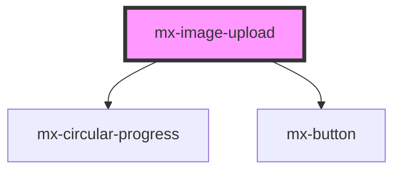

# mx-image-upload

<!-- Auto Generated Below -->

## Properties

| Property            | Attribute             | Description                                                                                                               | Type                                          | Default     |
| ------------------- | --------------------- | ------------------------------------------------------------------------------------------------------------------------- | --------------------------------------------- | ----------- |
| `acceptImage`       | `accept-image`        | Set `acceptImage` to `false` and `acceptPdf` to `true` to only accept PDF files.  Set both to `false` to accept any file. | `boolean`                                     | `true`      |
| `acceptPdf`         | `accept-pdf`          | Set `acceptImage` to `false` and `acceptPdf` to `true` to only accept PDF files.  Set both to `false` to accept any file. | `boolean`                                     | `false`     |
| `assetName`         | `asset-name`          | Replaces the word "image" in the default dropzone text (i.e. "No image to show").                                         | `string`                                      | `'image'`   |
| `avatar`            | `avatar`              | Sets the width and height to 80px and changes the icon.                                                                   | `boolean`                                     | `false`     |
| `height`            | `height`              | The height of the dropzone / thumbnail container (e.g. "400px" or "50%").                                                 | `string`                                      | `undefined` |
| `icon`              | `icon`                | The class name of the icon to use instead of the default icon.                                                            | `string`                                      | `undefined` |
| `inputId`           | `input-id`            | The `id` attribute to apply to the input element.                                                                         | `string`                                      | `undefined` |
| `isUploaded`        | `is-uploaded`         | Set to `true` to show the Remove button, thumbnail, and `uploaded` slot content.                                          | `boolean`                                     | `false`     |
| `isUploading`       | `is-uploading`        | Set to `true` to disable the button and show the circular progress indicator.                                             | `boolean`                                     | `false`     |
| `name`              | `name`                | The `name` attribute for the `input` element.                                                                             | `string`                                      | `undefined` |
| `removeButtonLabel` | `remove-button-label` | The text to display on the Remove button                                                                                  | `string`                                      | `'Remove'`  |
| `showButton`        | `show-button`         | Set to `false` to hide the default Upload/Remove button.                                                                  | `boolean`                                     | `true`      |
| `showDropzoneText`  | `show-dropzone-text`  | Set to `false` to hide the dropzone text.                                                                                 | `boolean`                                     | `true`      |
| `showIcon`          | `show-icon`           | Set to `false` to hide the dropzone icon.                                                                                 | `boolean`                                     | `true`      |
| `thumbnailSize`     | `thumbnail-size`      | Sets the thumbnail sizing strategy relative to the container.                                                             | `"auto" \| "contain" \| "cover" \| "stretch"` | `'cover'`   |
| `thumbnailUrl`      | `thumbnail-url`       | The URL for the thumbnail of the currently selected image.                                                                | `string`                                      | `undefined` |
| `uploadButtonLabel` | `upload-button-label` | The text to display on the Upload button                                                                                  | `string`                                      | `'Upload'`  |
| `width`             | `width`               | The width of the dropzone / thumbnail container (e.g. "400px" or "50%").                                                  | `string`                                      | `undefined` |

## Methods

### `removeFile() => Promise<void>`

#### Returns

Type: `Promise<void>`

### `selectFile() => Promise<void>`

#### Returns

Type: `Promise<void>`

## Dependencies

### Depends on

- [mx-circular-progress](../mx-circular-progress)
- [mx-button](../mx-button)

### Graph

----------------------------------------------

*Built with [StencilJS](https://stenciljs.com/)*
