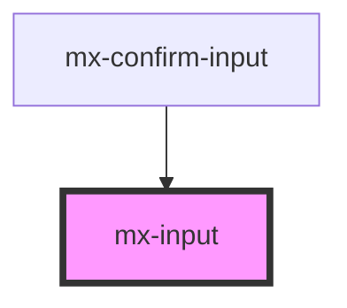

# mx-input

<!-- Auto Generated Below -->

## Properties

| Property              | Attribute               | Description                                                                                                                                          | Type                      | Default     |
| --------------------- | ----------------------- | ---------------------------------------------------------------------------------------------------------------------------------------------------- | ------------------------- | ----------- |
| `assistiveText`       | `assistive-text`        |                                                                                                                                                      | `string`                  | `undefined` |
| `dense`               | `dense`                 |                                                                                                                                                      | `boolean`                 | `false`     |
| `disabled`            | `disabled`              |                                                                                                                                                      | `boolean`                 | `false`     |
| `elAriaLabel`         | `el-aria-label`         | The aria-label attribute for the inner input element.                                                                                                | `string`                  | `undefined` |
| `error`               | `error`                 |                                                                                                                                                      | `boolean`                 | `false`     |
| `floatLabel`          | `float-label`           |                                                                                                                                                      | `boolean`                 | `false`     |
| `inputId`             | `input-id`              | The `id` attribute for the text input                                                                                                                | `string`                  | `undefined` |
| `label`               | `label`                 | Text for the label element                                                                                                                           | `string`                  | `undefined` |
| `labelClass`          | `label-class`           |                                                                                                                                                      | `string`                  | `''`        |
| `leftIcon`            | `left-icon`             | The class name of the icon to show on the left side of the input, _or_ an array of objects specifying an `icon`, `ariaLabel`, and `onClick` handler  | `MxInputIcon[] \| string` | `undefined` |
| `maxlength`           | `maxlength`             |                                                                                                                                                      | `number`                  | `undefined` |
| `name`                | `name`                  | The `name` attribute for the text input                                                                                                              | `string`                  | `undefined` |
| `outerContainerClass` | `outer-container-class` |                                                                                                                                                      | `string`                  | `''`        |
| `placeholder`         | `placeholder`           | Placeholder text for the input.  This will be ignored if `floatLabel` is `true`.                                                                     | `string`                  | `undefined` |
| `readonly`            | `readonly`              |                                                                                                                                                      | `boolean`                 | `false`     |
| `rightIcon`           | `right-icon`            | The class name of the icon to show on the right side of the input, _or_ an array of objects specifying an `icon`, `ariaLabel`, and `onClick` handler | `MxInputIcon[] \| string` | `undefined` |
| `suffix`              | `suffix`                | Text shown to the right of the input value                                                                                                           | `string`                  | `undefined` |
| `textarea`            | `textarea`              | Display a multi-line `textarea` instead of an `input`                                                                                                | `boolean`                 | `false`     |
| `textareaHeight`      | `textarea-height`       |                                                                                                                                                      | `string`                  | `'250px'`   |
| `type`                | `type`                  | The `type` attribute for the text input                                                                                                              | `string`                  | `'text'`    |
| `value`               | `value`                 |                                                                                                                                                      | `string`                  | `undefined` |

## Dependencies

### Used by

 - [mx-confirm-input](../mx-confirm-input)

### Graph

----------------------------------------------

*Built with [StencilJS](https://stenciljs.com/)*
