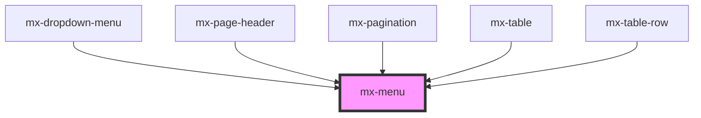

# mx-menu

<!-- Auto Generated Below -->

## Properties

| Property    | Attribute   | Description                                                                                                                                   | Type                                                                                                                                                                                                         | Default          |
| ----------- | ----------- | --------------------------------------------------------------------------------------------------------------------------------------------- | ------------------------------------------------------------------------------------------------------------------------------------------------------------------------------------------------------------ | ---------------- |
| `anchorEl`  | --          | The element that will open the menu when clicked                                                                                              | `HTMLElement`                                                                                                                                                                                                | `undefined`      |
| `isOpen`    | `is-open`   | This is set to true automatically when the `anchorEl` is clicked.  Dropdown menus read this prop internally for styling purposes.             | `boolean`                                                                                                                                                                                                    | `false`          |
| `offset`    | --          | An array of offsets in pixels. The first is the "skidding" along the edge of the `anchorEl`.  The second is the distance from the `anchorEl`. | `[number, number]`                                                                                                                                                                                           | `undefined`      |
| `placement` | `placement` | The placement of the menu, relative to the `anchorEl`.                                                                                        | `"auto" \| "auto-end" \| "auto-start" \| "bottom" \| "bottom-end" \| "bottom-start" \| "left" \| "left-end" \| "left-start" \| "right" \| "right-end" \| "right-start" \| "top" \| "top-end" \| "top-start"` | `'bottom-start'` |

## Events

| Event     | Description                   | Type                |
| --------- | ----------------------------- | ------------------- |
| `mxClose` | Emitted when the menu closes. | `CustomEvent<void>` |

## Methods

### `closeMenu() => Promise<boolean>`

Close the menu.  Returns a promise that resolves to false if the menu was already closed.

#### Returns

Type: `Promise<boolean>`

### `openMenu() => Promise<boolean>`

Open the menu.  Returns a promise that resolves to false if the menu was already open.

#### Returns

Type: `Promise<boolean>`

## Dependencies

### Used by

 - [mx-dropdown-menu](../mx-dropdown-menu)
 - [mx-page-header](../mx-page-header)
 - [mx-pagination](../mx-pagination)
 - [mx-table](../mx-table)
 - [mx-table-row](../mx-table-row)

### Graph

----------------------------------------------

*Built with [StencilJS](https://stenciljs.com/)*
