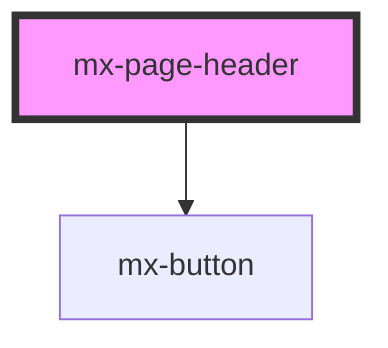

# mx-page-header

<!-- Auto Generated Below -->

## Properties

| Property            | Attribute             | Description                                                                                             | Type                  | Default  |
| ------------------- | --------------------- | ------------------------------------------------------------------------------------------------------- | --------------------- | -------- |
| `buttons`           | --                    | An array of prop objects for each button.  Use the `label` property to specify the button's inner text. | `IPageHeaderButton[]` | `[]`     |
| `pattern`           | `pattern`             | When set to true, the Page Header will use the themed background pattern.                               | `boolean`             | `false`  |
| `previousPageTitle` | `previous-page-title` | The text to display for the previous page link                                                          | `string`              | `'Back'` |
| `previousPageUrl`   | `previous-page-url`   | The URL for the previous page link                                                                      | `string`              | `''`     |

## Dependencies

### Depends on

- [mx-button](../mx-button)

### Graph

----------------------------------------------

*Built with [StencilJS](https://stenciljs.com/)*
