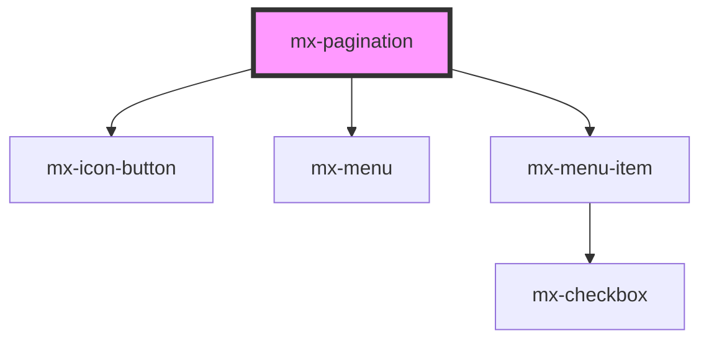

# mx-pagination

<!-- Auto Generated Below -->

## Properties

| Property             | Attribute           | Description                                                                   | Type       | Default             |
| -------------------- | ------------------- | ----------------------------------------------------------------------------- | ---------- | ------------------- |
| `disableNextPage`    | `disable-next-page` | Disable the next page button (i.e. when the last page was loaded from an API) | `boolean`  | `false`             |
| `disabled`           | `disabled`          | Disable the page buttons (i.e. when loading results)                          | `boolean`  | `false`             |
| `page`               | `page`              |                                                                               | `number`   | `0`                 |
| `rowsPerPage`        | `rows-per-page`     |                                                                               | `number`   | `100`               |
| `rowsPerPageOptions` | --                  |                                                                               | `number[]` | `[10, 25, 50, 100]` |
| `simple`             | `simple`            | Reduce the UI to only a page                                                  | `boolean`  | `false`             |
| `totalRows`          | `total-rows`        |                                                                               | `number`   | `undefined`         |

## Events

| Event          | Description | Type                                                  |
| -------------- | ----------- | ----------------------------------------------------- |
| `mxPageChange` |             | `CustomEvent<{ rowsPerPage: number; page: number; }>` |

## Dependencies

### Depends on

- [mx-icon-button](../mx-icon-button)
- [mx-menu](../mx-menu)
- [mx-menu-item](../mx-menu-item)

### Graph

----------------------------------------------

*Built with [StencilJS](https://stenciljs.com/)*
