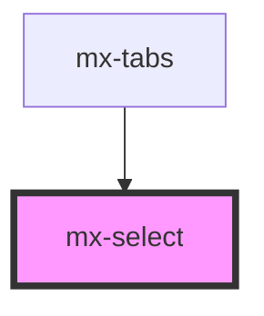

# mx-select

<!-- Auto Generated Below -->

## Properties

| Property        | Attribute        | Description                               | Type      | Default     |
| --------------- | ---------------- | ----------------------------------------- | --------- | ----------- |
| `ariaLabel`     | `aria-label`     |                                           | `string`  | `undefined` |
| `assistiveText` | `assistive-text` | Helpful text to show below the select     | `string`  | `undefined` |
| `dense`         | `dense`          |                                           | `boolean` | `false`     |
| `disabled`      | `disabled`       |                                           | `boolean` | `false`     |
| `elevated`      | `elevated`       | Style with a 1dp elevation                | `boolean` | `false`     |
| `error`         | `error`          |                                           | `boolean` | `false`     |
| `flat`          | `flat`           | Style with a "flat" border color          | `boolean` | `false`     |
| `label`         | `label`          |                                           | `string`  | `undefined` |
| `labelClass`    | `label-class`    | Additional classes for the label          | `string`  | `''`        |
| `name`          | `name`           |                                           | `string`  | `undefined` |
| `selectId`      | `select-id`      | The `id` attribute for the select element | `string`  | `undefined` |
| `suffix`        | `suffix`         | Text shown to the left of the arrow       | `string`  | `undefined` |
| `value`         | `value`          |                                           | `any`     | `undefined` |

## Dependencies

### Used by

 - [mx-tabs](../mx-tabs)

### Graph

----------------------------------------------

*Built with [StencilJS](https://stenciljs.com/)*
