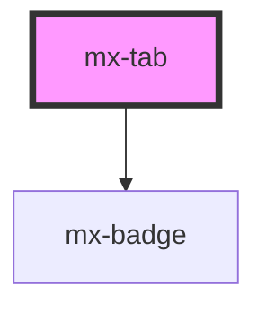

# mx-tab

<!-- Auto Generated Below -->

## Properties

| Property     | Attribute     | Description                                                                           | Type      | Default |
| ------------ | ------------- | ------------------------------------------------------------------------------------- | --------- | ------- |
| `ariaLabel`  | `aria-label`  | If you are not providing a `label`, this should be provided instead for accessibility | `string`  | `''`    |
| `badge`      | `badge`       | Display a dot badge                                                                   | `boolean` | `false` |
| `badgeClass` | `badge-class` | Additional classes for the badge                                                      | `string`  | `''`    |
| `icon`       | `icon`        | Class name of icon to display                                                         | `string`  | `''`    |
| `label`      | `label`       | Label text to display                                                                 | `string`  | `''`    |
| `selected`   | `selected`    | Only set this if you are not using the `mx-tabs` `value` prop                         | `boolean` | `false` |

## Dependencies

### Depends on

- [mx-badge](../mx-badge)

### Graph

----------------------------------------------

*Built with [StencilJS](https://stenciljs.com/)*
