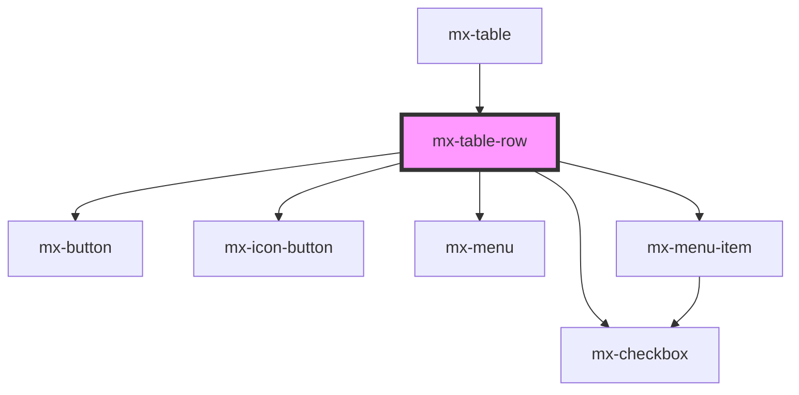

# mx-table-row

<!-- Auto Generated Below -->

## Properties

| Property  | Attribute | Description                                                                                                           | Type                | Default     |
| --------- | --------- | --------------------------------------------------------------------------------------------------------------------- | ------------------- | ----------- |
| `actions` | --        | An array of Menu Item props to create the actions menu, including a `value` property for each menu item's inner text. | `ITableRowAction[]` | `[]`        |
| `checked` | `checked` |                                                                                                                       | `boolean`           | `false`     |
| `rowId`   | `row-id`  | This is required for checkable rows in order to persist the checked state through sorting and pagination.             | `string`            | `undefined` |

## Events

| Event            | Description                                                                                                | Type                                                       |
| ---------------- | ---------------------------------------------------------------------------------------------------------- | ---------------------------------------------------------- |
| `mxCheck`        | Emits the `rowId` and `checked` state (via `Event.detail`) of the row whenever it is (un)checked           | `CustomEvent<{ rowId: string; checked: boolean; }>`        |
| `mxDragKeyDown`  | Emits the `KeyboardEvent.key` when a key is pressed while keyboard dragging.  Handled by the parent table. | `CustomEvent<string>`                                      |
| `mxRowDragEnd`   | Emitted when dragging ends.  Handled by the parent table.                                                  | `CustomEvent<{ isKeyboard: boolean; isCancel: boolean; }>` |
| `mxRowDragStart` | Emitted when dragging starts.  Handled by the parent table.                                                | `CustomEvent<{ isKeyboard: boolean; }>`                    |

## Methods

### `collapse() => Promise<void>`

#### Returns

Type: `Promise<void>`

### `expand() => Promise<void>`

#### Returns

Type: `Promise<void>`

### `focusDragHandle() => Promise<void>`

#### Returns

Type: `Promise<void>`

### `getChildren() => Promise<HTMLElement[]>`

Returns the immediate children of the row, as well as the immediate children of all nested
rows.  If a child is `display: contents` (i.e. the first column wrapper), then its children
are added.

#### Returns

Type: `Promise<HTMLElement[]>`

### `getHeight() => Promise<number>`

Calculate the height of the row, including the height of nested rows

#### Returns

Type: `Promise<number>`

### `translateRow(x: number, y: number) => Promise<void>`

Apply a CSS transform to translate the row by `x` and `y` pixels

#### Returns

Type: `Promise<void>`

## Dependencies

### Used by

 - [mx-table](../mx-table)

### Depends on

- [mx-checkbox](../mx-checkbox)
- [mx-button](../mx-button)
- [mx-icon-button](../mx-icon-button)
- [mx-menu](../mx-menu)
- [mx-menu-item](../mx-menu-item)

### Graph

----------------------------------------------

*Built with [StencilJS](https://stenciljs.com/)*
