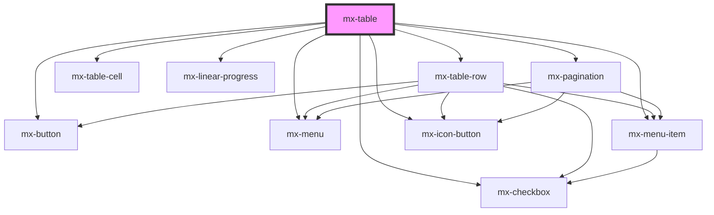

# mx-table

<!-- Auto Generated Below -->

## Properties

| Property              | Attribute               | Description                                                                                                                                                                              | Type                                    | Default     |
| --------------------- | ----------------------- | ---------------------------------------------------------------------------------------------------------------------------------------------------------------------------------------- | --------------------------------------- | ----------- |
| `autoWidth`           | `auto-width`            | Set to `true` to allow smaller tables to shrink to less than 100% width on larger screens                                                                                                | `boolean`                               | `false`     |
| `checkOnRowClick`     | `check-on-row-click`    | Set to `false` to prevent checking rows by clicking on them (outside the checkboxes).                                                                                                    | `boolean`                               | `true`      |
| `checkable`           | `checkable`             | Make rows checkable.  You must either provide a `getRowId` getter (for generated rows), or provide a `rowId` for every `mx-table-row` if creating the rows manually in the table's slot. | `boolean`                               | `false`     |
| `columns`             | --                      | An array of column definitions.  If not specified, a column will be generated for each property on the row object.                                                                       | `ITableColumn[]`                        | `[]`        |
| `disableNextPage`     | `disable-next-page`     | Disable the next-page button.  Useful when using server-side pagination and the total number of rows is unknown.                                                                         | `boolean`                               | `false`     |
| `disablePagination`   | `disable-pagination`    | Disable the pagination buttons (i.e. while loading results)                                                                                                                              | `boolean`                               | `false`     |
| `draggableRows`       | `draggable-rows`        | Enables reordering of rows via drag and drop.                                                                                                                                            | `boolean`                               | `false`     |
| `getGroupByHeading`   | --                      | A function that returns the subheader text for a `groupBy` value.  If not provided, the `row[groupBy]` value will be shown in the subheader rows.                                        | `(row: Object) => string`               | `undefined` |
| `getMultiRowActions`  | --                      |                                                                                                                                                                                          | `(rows: string[]) => ITableRowAction[]` | `undefined` |
| `getRowActions`       | --                      |                                                                                                                                                                                          | `(row: Object) => ITableRowAction[]`    | `undefined` |
| `getRowId`            | --                      | A function that returns the `rowId` prop for each generated `mx-table-row`. This is only required if the table is `checkable` and is auto-generating rows (not using the default slot).  | `(row: Object) => string`               | `undefined` |
| `groupBy`             | `group-by`              | The row property to use for grouping rows.  The `rows` prop must be provided as well.                                                                                                    | `string`                                | `null`      |
| `hoverable`           | `hoverable`             |                                                                                                                                                                                          | `boolean`                               | `true`      |
| `mutateOnDrag`        | `mutate-on-drag`        | Set to `false` to not mutate the `rows` prop when rows are reordered via drag and drop.                                                                                                  | `boolean`                               | `true`      |
| `page`                | `page`                  | The page to display                                                                                                                                                                      | `number`                                | `1`         |
| `paginate`            | `paginate`              | Show the pagination component.  Setting this to `false` will show all rows.                                                                                                              | `boolean`                               | `true`      |
| `progressAppearDelay` | `progress-appear-delay` | Delay the appearance of the progress bar for this many milliseconds                                                                                                                      | `number`                                | `0`         |
| `progressValue`       | `progress-value`        | The progress bar percentage from 0 to 100. If not provided (or set to `null`), an indeterminate progress bar will be displayed.                                                          | `number`                                | `null`      |
| `rows`                | --                      | An array of objects that defines the table's dataset.                                                                                                                                    | `Object[]`                              | `[]`        |
| `rowsPerPage`         | `rows-per-page`         |                                                                                                                                                                                          | `number`                                | `10`        |
| `rowsPerPageOptions`  | --                      |                                                                                                                                                                                          | `number[]`                              | `undefined` |
| `serverPaginate`      | `server-paginate`       | Do not sort or paginate client-side. Use events to send server requests instead.                                                                                                         | `boolean`                               | `false`     |
| `showCheckAll`        | `show-check-all`        | Set to `false` to hide the (un)check all checkbox at the top of the table.                                                                                                               | `boolean`                               | `true`      |
| `showProgressBar`     | `show-progress-bar`     | Show a progress bar below the header row                                                                                                                                                 | `boolean`                               | `false`     |
| `sortAscending`       | `sort-ascending`        |                                                                                                                                                                                          | `boolean`                               | `true`      |
| `sortBy`              | `sort-by`               | The property on the row objects that will be used for sorting                                                                                                                            | `string`                                | `undefined` |
| `totalRows`           | `total-rows`            | The total number of unpaginated rows.  This is ignored for client-side pagination. For server-side pagination, omitting this prop will remove the last-page button.                      | `number`                                | `undefined` |

## Events

| Event                 | Description                                                                                                                                                                                                     | Type                                                       |
| --------------------- | --------------------------------------------------------------------------------------------------------------------------------------------------------------------------------------------------------------- | ---------------------------------------------------------- |
| `mxRowCheck`          | Emitted when a row is (un)checked.  The `Event.detail` will be the array of checked `rowId`s.                                                                                                                   | `CustomEvent<string[]>`                                    |
| `mxRowMove`           | Emitted when a row is dragged to a new position. The `Event.detail` object will contain the `rowId` (if set), `oldIndex`, and `newIndex`.                                                                       | `CustomEvent<any>`                                         |
| `mxSortChange`        | Emitted when a sortable column's header is clicked.                                                                                                                                                             | `CustomEvent<{ sortBy: string; sortAscending: boolean; }>` |
| `mxVisibleRowsChange` | Emitted when the sorting, pagination, or rows data changes. The `Event.detail` will contain the sorted, paginated array of visible rows.  This is useful for building a custom row layout via the default slot. | `CustomEvent<Object[]>`                                    |

## Methods

### `checkAll() => Promise<void>`

#### Returns

Type: `Promise<void>`

### `checkNone() => Promise<void>`

#### Returns

Type: `Promise<void>`

### `getCheckedRowIds() => Promise<string[]>`

#### Returns

Type: `Promise<string[]>`

### `setCheckedRowIds(checkedRowIds?: string[]) => Promise<void>`

#### Returns

Type: `Promise<void>`

## Dependencies

### Depends on

- [mx-table-row](../mx-table-row)
- [mx-table-cell](../mx-table-cell)
- [mx-checkbox](../mx-checkbox)
- [mx-button](../mx-button)
- [mx-menu](../mx-menu)
- [mx-menu-item](../mx-menu-item)
- [mx-icon-button](../mx-icon-button)
- [mx-linear-progress](../mx-linear-progress)
- [mx-pagination](../mx-pagination)

### Graph

----------------------------------------------

*Built with [StencilJS](https://stenciljs.com/)*
