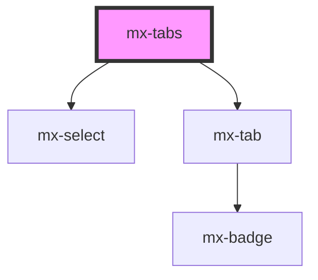

# mx-tabs

<!-- Auto Generated Below -->

## Properties

| Property            | Attribute | Description                                           | Type            | Default     |
| ------------------- | --------- | ----------------------------------------------------- | --------------- | ----------- |
| `fill`              | `fill`    | Stretch tabs to fill the entire width                 | `boolean`       | `false`     |
| `tabs` _(required)_ | --        | An array of objects for each tab (see Tab Properties) | `IMxTabProps[]` | `undefined` |
| `value`             | `value`   | The index of the selected tab                         | `number`        | `null`      |

## Events

| Event      | Description                                            | Type                  |
| ---------- | ------------------------------------------------------ | --------------------- |
| `mxChange` | Emits the newly selected tab's index as `Event.detail` | `CustomEvent<number>` |

## Dependencies

### Depends on

- [mx-select](../mx-select)
- [mx-tab](../mx-tab)

### Graph

----------------------------------------------

*Built with [StencilJS](https://stenciljs.com/)*
