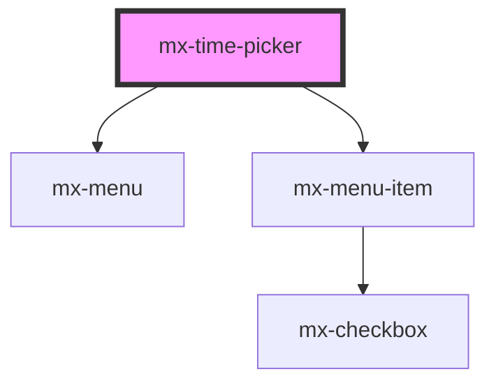

# mx-time-picker

<!-- Auto Generated Below -->

## Properties

| Property        | Attribute        | Description                                       | Type      | Default     |
| --------------- | ---------------- | ------------------------------------------------- | --------- | ----------- |
| `ariaLabel`     | `aria-label`     |                                                   | `string`  | `undefined` |
| `assistiveText` | `assistive-text` | Helpful text to show below the picker             | `string`  | `undefined` |
| `dense`         | `dense`          |                                                   | `boolean` | `false`     |
| `disabled`      | `disabled`       |                                                   | `boolean` | `false`     |
| `error`         | `error`          |                                                   | `boolean` | `false`     |
| `floatLabel`    | `float-label`    |                                                   | `boolean` | `false`     |
| `inputId`       | `input-id`       | The `id` attribute for the internal input element | `string`  | `undefined` |
| `label`         | `label`          |                                                   | `string`  | `undefined` |
| `name`          | `name`           |                                                   | `string`  | `undefined` |
| `value`         | `value`          | The time in 24-hour hh:mm format                  | `string`  | `undefined` |

## Dependencies

### Depends on

- [mx-menu](../mx-menu)
- [mx-menu-item](../mx-menu-item)

### Graph

----------------------------------------------

*Built with [StencilJS](https://stenciljs.com/)*
