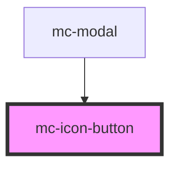

# mc-icon-button

<!-- Auto Generated Below -->

## Properties

| Property      | Attribute       | Description                                            | Type                              | Default     |
| ------------- | --------------- | ------------------------------------------------------ | --------------------------------- | ----------- |
| `btnType`     | `btn-type`      |                                                        | `"close" \| "normal" \| "small"`  | `'normal'`  |
| `disabled`    | `disabled`      |                                                        | `boolean`                         | `false`     |
| `elAriaLabel` | `el-aria-label` | The aria-label attribute for the inner button element. | `string`                          | `undefined` |
| `form`        | `form`          |                                                        | `string`                          | `undefined` |
| `formaction`  | `formaction`    |                                                        | `string`                          | `undefined` |
| `href`        | `href`          | Create button as link                                  | `string`                          | `undefined` |
| `icon`        | `icon`          | Class name of icon                                     | `string`                          | `undefined` |
| `target`      | `target`        | Only for link buttons                                  | `string`                          | `undefined` |
| `type`        | `type`          |                                                        | `"button" \| "reset" \| "submit"` | `'button'`  |
| `value`       | `value`         |                                                        | `string`                          | `undefined` |

## Dependencies

### Used by

 - [mc-modal](../mc-modal)

### Graph

----------------------------------------------

