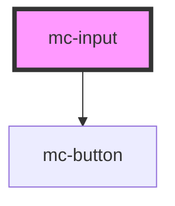

# mc-input

<!-- Auto Generated Below -->

## Properties

| Property             | Attribute              | Description | Type                                                                                     | Default     |
| -------------------- | ---------------------- | ----------- | ---------------------------------------------------------------------------------------- | ----------- |
| `disabled`           | `disabled`             |             | `boolean`                                                                                | `false`     |
| `elAriaLabel`        | `el-aria-label`        |             | `string`                                                                                 | `undefined` |
| `error`              | `error`                |             | `boolean`                                                                                | `false`     |
| `errorMsg`           | `error-msg`            |             | `string`                                                                                 | `''`        |
| `hideCharacterCount` | `hide-character-count` |             | `boolean`                                                                                | `undefined` |
| `inputId`            | `input-id`             |             | `string`                                                                                 | `undefined` |
| `instructions`       | `instructions`         |             | `string`                                                                                 | `''`        |
| `label`              | `label`                |             | `string`                                                                                 | `''`        |
| `maxlength`          | `maxlength`            |             | `number`                                                                                 | `undefined` |
| `name`               | `name`                 |             | `string`                                                                                 | `''`        |
| `placeholder`        | `placeholder`          |             | `string`                                                                                 | `''`        |
| `readonly`           | `readonly`             |             | `boolean`                                                                                | `false`     |
| `required`           | `required`             |             | `boolean`                                                                                | `false`     |
| `search`             | `search`               |             | `boolean`                                                                                | `false`     |
| `searchLabel`        | `search-label`         |             | `string`                                                                                 | `'Search'`  |
| `type`               | `type`                 |             | `"email" \| "file" \| "hidden" \| "number" \| "password" \| "search" \| "tel" \| "text"` | `undefined` |
| `value`              | `value`                |             | `string`                                                                                 | `''`        |

## Dependencies

### Depends on

- [mc-button](../mc-button)

### Graph

----------------------------------------------

