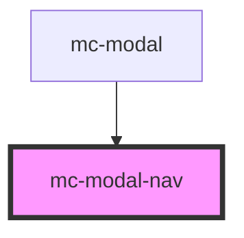

# mc-modal-nav

<!-- Auto Generated Below -->

## Properties

| Property  | Attribute | Description | Type     | Default     |
| --------- | --------- | ----------- | -------- | ----------- |
| `heading` | `heading` |             | `string` | `undefined` |

## Dependencies

### Used by

 - [mc-modal](../mc-modal)

### Graph

----------------------------------------------

