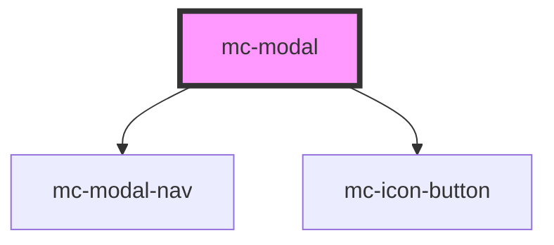

# mc-modal

<!-- Auto Generated Below -->

## Properties

| Property              | Attribute                | Description                                                       | Type      | Default     |
| --------------------- | ------------------------ | ----------------------------------------------------------------- | --------- | ----------- |
| `closeOnEscape`       | `close-on-escape`        | If set to false, pressing Escape will not close the modal.        | `boolean` | `true`      |
| `closeOnOutsideClick` | `close-on-outside-click` | If set to false, clicking the backdrop will not close the modal.  | `boolean` | `true`      |
| `description`         | `description`            | An optional description to display above the modal content        | `string`  | `undefined` |
| `heading`             | `heading`                | Heading text. Use the `heading` slot instead if markup is needed. | `string`  | `undefined` |
| `hideCloseButton`     | `hide-close-button`      |                                                                   | `boolean` | `false`     |
| `isOpen`              | `is-open`                | Toggle the modal                                                  | `boolean` | `false`     |
| `navHeading`          | `nav-heading`            | The nav menu heading (if using the nav slot)                      | `string`  | `undefined` |

## Events

| Event     | Description | Type               |
| --------- | ----------- | ------------------ |
| `mcClose` |             | `CustomEvent<any>` |

## Dependencies

### Depends on

- [mc-modal-nav](../mc-modal-nav)
- [mc-icon-button](../mc-icon-button)

### Graph

----------------------------------------------

