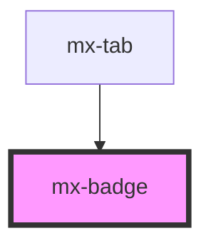

# mx-badge

<!-- Auto Generated Below -->

## Properties

| Property     | Attribute     | Description                                                                                                                                       | Type                                                                             | Default     |
| ------------ | ------------- | ------------------------------------------------------------------------------------------------------------------------------------------------- | -------------------------------------------------------------------------------- | ----------- |
| `badgeClass` | `badge-class` | Additional classes to add to the badge itself                                                                                                     | `string`                                                                         | `undefined` |
| `bottom`     | `bottom`      | Anchor the badge to the bottom of the wrapped content                                                                                             | `boolean`                                                                        | `false`     |
| `icon`       | `icon`        | Class name of icon                                                                                                                                | `string`                                                                         | `undefined` |
| `indicator`  | `indicator`   | Render as a small indicator shape with no inner text.  If the prop is present, but no string value is passed, the shape will default to `circle`. | `"hexagon" \| "square" \| "star" \| "triangle-down" \| "triangle-up" \| boolean` | `undefined` |
| `left`       | `left`        | Anchor the badge to the left of the wrapped content                                                                                               | `boolean`                                                                        | `false`     |
| `offset`     | `offset`      | Offset badge inward by this many pixels (e.g. 10 for icon buttons)                                                                                | `number`                                                                         | `0`         |
| `squared`    | `squared`     | Make the corners a little more square (best for standalone text)                                                                                  | `boolean`                                                                        | `false`     |
| `value`      | `value`       | The value to display inside the badge                                                                                                             | `any`                                                                            | `undefined` |

## Dependencies

### Used by

 - [mx-tab](../mx-tab)

### Graph

----------------------------------------------

