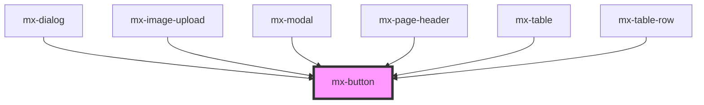

# mx-button

<!-- Auto Generated Below -->

## Properties

| Property      | Attribute       | Description                                            | Type                                                          | Default       |
| ------------- | --------------- | ------------------------------------------------------ | ------------------------------------------------------------- | ------------- |
| `btnType`     | `btn-type`      |                                                        | `"action" \| "contained" \| "outlined" \| "simple" \| "text"` | `'contained'` |
| `disabled`    | `disabled`      |                                                        | `boolean`                                                     | `false`       |
| `dropdown`    | `dropdown`      | Show chevron icon                                      | `boolean`                                                     | `false`       |
| `elAriaLabel` | `el-aria-label` | The aria-label attribute for the inner button element. | `string`                                                      | `undefined`   |
| `form`        | `form`          |                                                        | `string`                                                      | `undefined`   |
| `formaction`  | `formaction`    |                                                        | `string`                                                      | `undefined`   |
| `full`        | `full`          | Sets display to flex instead of inline-flex            | `boolean`                                                     | `false`       |
| `href`        | `href`          | Create button as link                                  | `string`                                                      | `undefined`   |
| `icon`        | `icon`          | Class name of icon                                     | `string`                                                      | `undefined`   |
| `target`      | `target`        | Only for link buttons                                  | `string`                                                      | `undefined`   |
| `type`        | `type`          |                                                        | `"button" \| "reset" \| "submit"`                             | `'button'`    |
| `value`       | `value`         |                                                        | `string`                                                      | `undefined`   |
| `xl`          | `xl`            |                                                        | `boolean`                                                     | `false`       |

## Dependencies

### Used by

 - [mx-dialog](../mx-dialog)
 - [mx-image-upload](../mx-image-upload)
 - [mx-modal](../mx-modal)
 - [mx-page-header](../mx-page-header)
 - [mx-table](../mx-table)
 - [mx-table-row](../mx-table-row)

### Graph

----------------------------------------------

