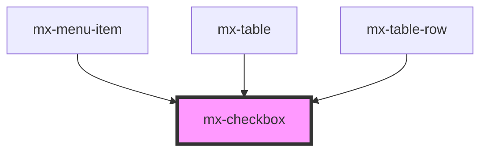

# mx-checkbox

<!-- Auto Generated Below -->

## Properties

| Property        | Attribute       | Description                                                                   | Type      | Default     |
| --------------- | --------------- | ----------------------------------------------------------------------------- | --------- | ----------- |
| `checked`       | `checked`       |                                                                               | `boolean` | `false`     |
| `disabled`      | `disabled`      |                                                                               | `boolean` | `false`     |
| `elAriaLabel`   | `el-aria-label` | The aria-label attribute for the inner input element.                         | `string`  | `undefined` |
| `hideLabel`     | `hide-label`    | Hide the label text visually, but still make it accessible for screen readers | `boolean` | `false`     |
| `indeterminate` | `indeterminate` |                                                                               | `boolean` | `false`     |
| `labelClass`    | `label-class`   |                                                                               | `string`  | `''`        |
| `labelLeft`     | `label-left`    |                                                                               | `boolean` | `false`     |
| `labelName`     | `label-name`    |                                                                               | `string`  | `''`        |
| `name`          | `name`          |                                                                               | `string`  | `''`        |
| `value`         | `value`         |                                                                               | `string`  | `''`        |

## Dependencies

### Used by

 - [mx-menu-item](../mx-menu-item)
 - [mx-table](../mx-table)
 - [mx-table-row](../mx-table-row)

### Graph

----------------------------------------------

