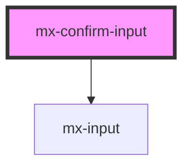

# mx-confirm-input

<!-- Auto Generated Below -->

## Properties

| Property              | Attribute               | Description | Type                      | Default     |
| --------------------- | ----------------------- | ----------- | ------------------------- | ----------- |
| `assistiveText`       | `assistive-text`        |             | `string`                  | `undefined` |
| `dense`               | `dense`                 |             | `boolean`                 | `false`     |
| `disabled`            | `disabled`              |             | `boolean`                 | `false`     |
| `elAriaLabel`         | `el-aria-label`         |             | `string`                  | `undefined` |
| `error`               | `error`                 |             | `boolean`                 | `false`     |
| `floatLabel`          | `float-label`           |             | `boolean`                 | `false`     |
| `hideCharacterCount`  | `hide-character-count`  |             | `boolean`                 | `false`     |
| `inputId`             | `input-id`              |             | `string`                  | `undefined` |
| `label`               | `label`                 |             | `string`                  | `undefined` |
| `labelClass`          | `label-class`           |             | `string`                  | `''`        |
| `leftIcon`            | `left-icon`             |             | `MxInputIcon[] \| string` | `undefined` |
| `maxlength`           | `maxlength`             |             | `number`                  | `undefined` |
| `name`                | `name`                  |             | `string`                  | `undefined` |
| `outerContainerClass` | `outer-container-class` |             | `string`                  | `''`        |
| `placeholder`         | `placeholder`           |             | `string`                  | `undefined` |
| `readonly`            | `readonly`              |             | `boolean`                 | `false`     |
| `rightIcon`           | `right-icon`            |             | `MxInputIcon[] \| string` | `undefined` |
| `step`                | `step`                  |             | `string`                  | `undefined` |
| `suffix`              | `suffix`                |             | `string`                  | `undefined` |
| `textarea`            | `textarea`              |             | `boolean`                 | `false`     |
| `textareaHeight`      | `textarea-height`       |             | `string`                  | `'250px'`   |
| `type`                | `type`                  |             | `string`                  | `'text'`    |
| `value`               | `value`                 |             | `string`                  | `undefined` |

## Dependencies

### Depends on

- [mx-input](../mx-input)

### Graph

----------------------------------------------

