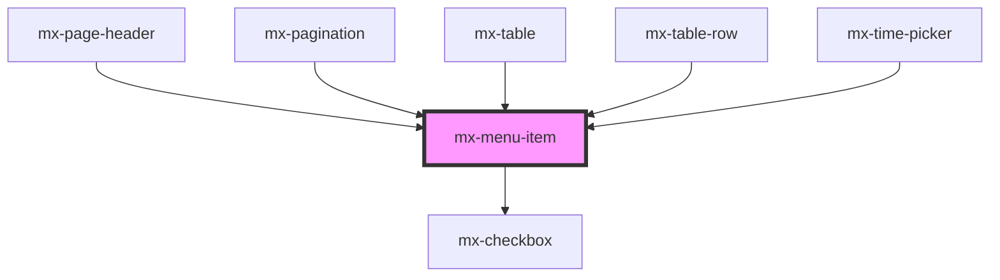

# mx-menu-item

<!-- Auto Generated Below -->

## Properties

| Property      | Attribute      | Description                                                                                                                                                                                           | Type      | Default     |
| ------------- | -------------- | ----------------------------------------------------------------------------------------------------------------------------------------------------------------------------------------------------- | --------- | ----------- |
| `checked`     | `checked`      | If `multiSelect` is false, this will render a checkmark on the right side of the menu item.  If both `multiSelect` and `checked` are `true`, then the rendered multi-select checkbox will be checked. | `boolean` | `false`     |
| `disabled`    | `disabled`     |                                                                                                                                                                                                       | `boolean` | `false`     |
| `icon`        | `icon`         | The class name of the icon to display on the left. This is sometimes automatically set to `null` to add an empty icon for alignment purposes (when a sibling menu item has an icon).                  | `string`  | `undefined` |
| `label`       | `label`        | A label to display above the menu item                                                                                                                                                                | `string`  | `undefined` |
| `multiSelect` | `multi-select` | Render a checkbox as part of the menu item.  On small screens, the checkbox will appear on the left; otherwise, it will be on the right.                                                              | `boolean` | `false`     |
| `selected`    | `selected`     | This is automatically set by a parent Dropdown Menu.                                                                                                                                                  | `boolean` | `false`     |
| `subtitle`    | `subtitle`     | A subtitle to display below the menu item text                                                                                                                                                        | `string`  | `undefined` |

## Events

| Event     | Description                                                                                               | Type                      |
| --------- | --------------------------------------------------------------------------------------------------------- | ------------------------- |
| `mxClick` | Fired when an enabled menu item without a submenu is clicked. Used interally to close all ancestor menus. | `CustomEvent<MouseEvent>` |

## Methods

### `closeSubMenu() => Promise<boolean>`

Close the item's submenu.

#### Returns

Type: `Promise<boolean>`

### `focusMenuItem() => Promise<void>`

Focuses the menu item.

#### Returns

Type: `Promise<void>`

### `getValue() => Promise<string>`

Returns the menu item inner text (excluding any label or subtitle)

#### Returns

Type: `Promise<string>`

## Dependencies

### Used by

 - [mx-page-header](../mx-page-header)
 - [mx-pagination](../mx-pagination)
 - [mx-table](../mx-table)
 - [mx-table-row](../mx-table-row)
 - [mx-time-picker](../mx-time-picker)

### Depends on

- [mx-checkbox](../mx-checkbox)

### Graph

----------------------------------------------

