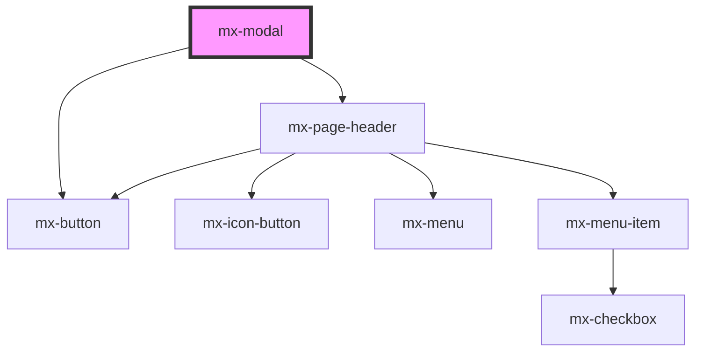

# mx-modal

<!-- Auto Generated Below -->

## Properties

| Property              | Attribute                | Description                                                                                                                                                    | Type             | Default     |
| --------------------- | ------------------------ | -------------------------------------------------------------------------------------------------------------------------------------------------------------- | ---------------- | ----------- |
| `buttons`             | --                       | An array of prop objects for buttons to display in the button tray.  Use the `label` property to specify the button's inner text.                              | `IModalButton[]` | `[]`        |
| `closeOnEscape`       | `close-on-escape`        | If set to false, pressing Escape will not close the modal.                                                                                                     | `boolean`        | `true`      |
| `closeOnOutsideClick` | `close-on-outside-click` | If set to false, clicking the backdrop will not close the modal.                                                                                               | `boolean`        | `true`      |
| `contentClass`        | `content-class`          | Additional classes for the inner scrolling container.                                                                                                          | `string`         | `''`        |
| `description`         | `description`            | An optional description to display above the modal content                                                                                                     | `string`         | `undefined` |
| `fromLeft`            | `from-left`              | Instead of centering, attach the modal to the left side of the window                                                                                          | `boolean`        | `false`     |
| `fromRight`           | `from-right`             | Instead of centering, attach the modal to the right side of the window                                                                                         | `boolean`        | `false`     |
| `isOpen`              | `is-open`                | Toggle the modal                                                                                                                                               | `boolean`        | `false`     |
| `large`               | `large`                  | Set to true to stretch the modal to nearly fill the width and height of the page (on desktop-sized screens).  Otherwise, the maximum dimensions are 800x600px. | `boolean`        | `false`     |
| `previousPageTitle`   | `previous-page-title`    | The text to display for the previous page link                                                                                                                 | `string`         | `'Back'`    |
| `previousPageUrl`     | `previous-page-url`      | The URL for the previous page link                                                                                                                             | `string`         | `''`        |

## Events

| Event     | Description | Type               |
| --------- | ----------- | ------------------ |
| `mxClose` |             | `CustomEvent<any>` |

## Dependencies

### Depends on

- [mx-button](../mx-button)
- [mx-page-header](../mx-page-header)

### Graph

----------------------------------------------

