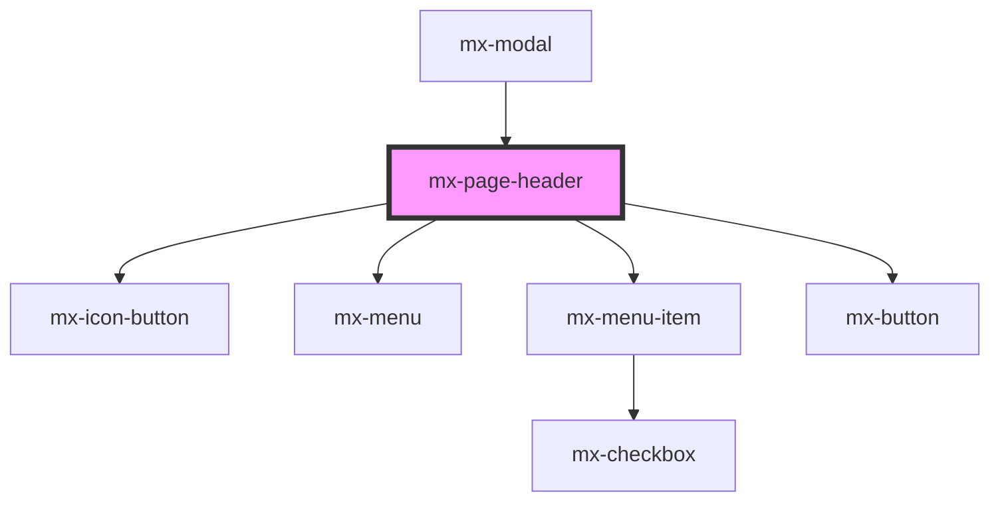

# mx-page-header

<!-- Auto Generated Below -->

## Properties

| Property            | Attribute             | Description                                                                                             | Type                  | Default  |
| ------------------- | --------------------- | ------------------------------------------------------------------------------------------------------- | --------------------- | -------- |
| `buttons`           | --                    | An array of prop objects for each button.  Use the `label` property to specify the button's inner text. | `IPageHeaderButton[]` | `[]`     |
| `modal`             | `modal`               | This flag is set by the Modal component to adjust the page header styling when used internally.         | `boolean`             | `false`  |
| `pattern`           | `pattern`             | When set to true, the Page Header will use the themed background pattern.                               | `boolean`             | `false`  |
| `previousPageTitle` | `previous-page-title` | The text to display for the previous page link                                                          | `string`              | `'Back'` |
| `previousPageUrl`   | `previous-page-url`   | The URL for the previous page link                                                                      | `string`              | `''`     |

## Methods

### `resetResizeObserver() => Promise<void>`

Attach a new ResizeObserver that calls `updateRenderTertiaryButtonAsMenu`

#### Returns

Type: `Promise<void>`

## Dependencies

### Used by

 - [mx-modal](../mx-modal)

### Depends on

- [mx-icon-button](../mx-icon-button)
- [mx-menu](../mx-menu)
- [mx-menu-item](../mx-menu-item)
- [mx-button](../mx-button)

### Graph

----------------------------------------------

